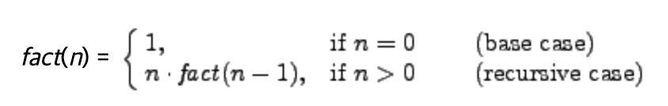
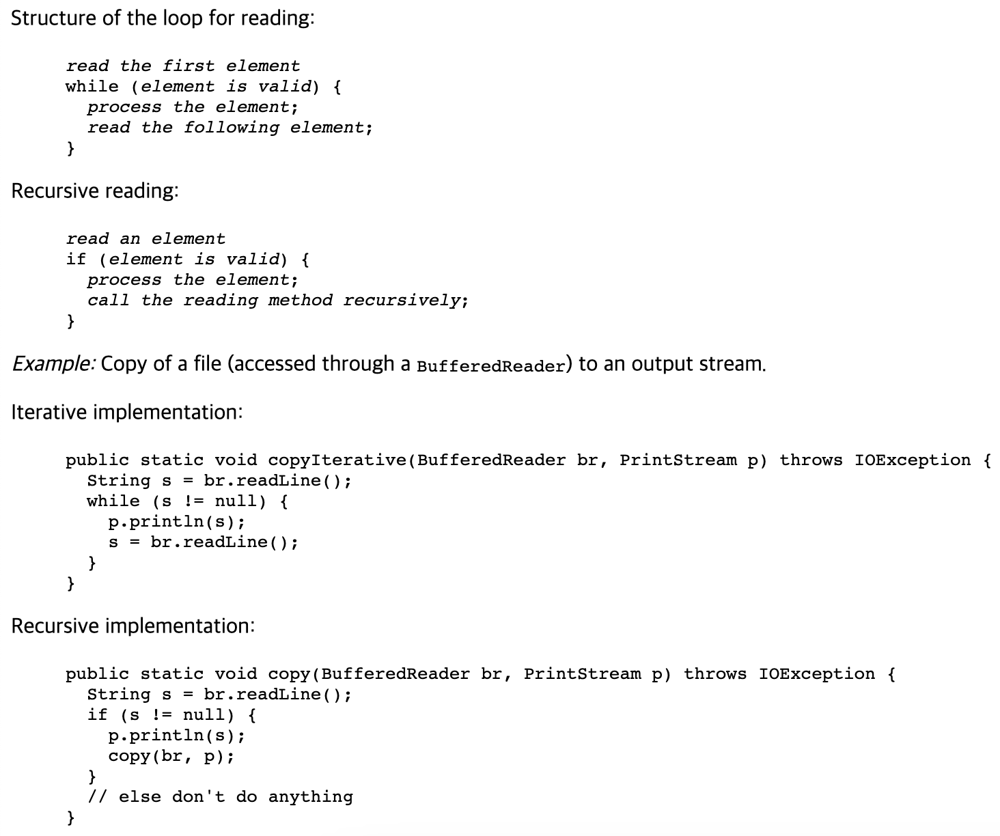
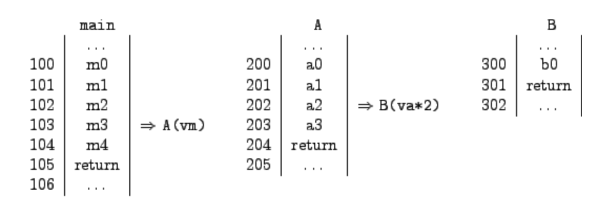
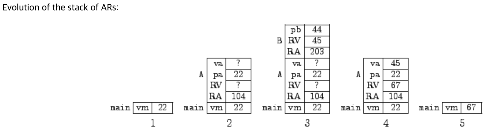

# 10장 Recursion(자기호출)

- 귀납적으로 정의된 도메인

  - 도메인: 특정한 요소가 어떠한 형식과 규칙을 갖추어야 하는지를 정의!

    - 1개 이상의 요소가 존재 해야함.
    - 하나 이상의 규칙으로 도메인을 추가 할 수 있어야함.

  - 예
    - 자연수
      - 0은 자연수 이다.
      - 어떠한 수 n이 자연수면, n + 1도 자연수라고 할 수 있다.
      - 이 외의 어떠한 수도 자연수로 취급될 수 없다.

- 귀납적으로 정의된 도메인과 재귀
  - 귀납적으로 정의된 영역의 요소는 재귀를 통해서 조작될 수 있습니다.



- 귀납적으로 정의된 도메인과 Recursion

  - 귀납적으로 정의가 된 요소는 쉽게 Recursion 형식으로 변경이 가능함.
  - 메서드 자체를 호출하여 문제를 해결이 가능한 경우, 메서드가 Recursive라고 한다.

  - 함수의 Recursive 정의는 함수의 작동하는 귀납적 정의 구조를 반영합니다.
    - 함수의 결과를 직접 결정하는 Base Case
    - 해당 도메인의 더 작은 값에 Recursion을 적용하는 Recursion Case
    - 함수가 작동하는 영역이 귀납적으로 정의된다는 사실은 Recursion을 적용하여 Base Case에 도달하여 종료

```java
public static long factorial(long n) {
  if (n == 0)
    return 1;
  else
    return n * factorial(n-1);
}
```

- 반복과 자기호출 비교

  - 반복의 특징

    - 초기화
    - 지정된 반복 횟수 만큼 동작
    - 종료 조건

  - 자기호출의 특징

    - Base Case
    - Recursion Case

  - 모든 재귀적 방법은 Stack을 사용하여 Recursion을 시뮬레이션하여 구현



- 문자열에서 해당 문자가 몇개 있는지 파악하는 Recursion

```java
public static int countChars(String s, char c) {
  if (s.length() == 0)
    return 0;
  else if (s.charAt(0) == c)
    return 1 + countChars(s.substring(1), c);
  else
    return countChars(s.substring(1), c);
}
```

- 숫자의 최대값을 구하는 Recursion
  - 반환문 앞에 함수 호출을 통해, 값을 가져오고 반환문을 통해서 값을 비교

```java
public static int maximum(BufferedReader br) throws IOException {
  String s = br.readLine();
  if (s == null)
    return 0;
  else {
    int i = Integer.parseInt(s);
    int m = maximum(br);
    return (m > i)? m : i;
  }
}
```

- 함수 Stack을 사용하여 문자의 순서를 뒤집기
  - 이러한 순서를 뒤집는 방식은 반복문으로 구현하기 힘들지만, Recursive한 방법으로는 쉽게 처리할 수 있음.

```java
public static void copyInverse(BufferedReader br, PrintStream p) throws IOException {
  String s = br.readLine();
  if (s != null) {
    copyInverse(br, p);
    p.println(s);
  }
}
```

- 주어진 조건을 만족하는 경우만 계산을 지속

```java
public static int countLinesColon(BufferedReader br) throws IOException {
  String s = br.readLine();
  if (s == null)
    return 0;
  else if (s.charAt(0) == ':')
    return 1 + countLinesColon(br);
  else
    return countLinesColon(br);
}
```

- Run-time 메모리 관리

- Recursion을 실행 시, 메모리의 다양한 부분을 처리할 수 있어야함.

- Java 바이트 코드가 포함된 부분 (Static Binding)

  - JVM에서 실행되는 코드
  - 컴파일 타임에 각 메서드에 대한 차원이 고정
  - _바인딩 한정자?, 리터럴? (문자열)_
    - 문자열 리터럴은, JVM에 저장되는 공간(Literal Pool)이 따로 존재
    - 컴파일 도중, 리터럴을 발견하면 따로 빼와서? 해당 공간에 저장
    - 어떠한 변수가 저장된 리터럴를 assignment 하면, 저장 공간에서 해당 리터럴의 주소를 넘겨줌.

- Heap (Dynamic Binding)

  - 동적으로 생성되는 객체를 보관하는 매모리의 일부
  - 각 객체(Object)는 다른 객체와 독립적으로 할당 및 할당해제

- Stack of Activation Records

  - 메서드의 지역 범위를 위한 메모리 공간
  - 메서드를 호출하여 실행 하거나 결과를 반환할 때, 동적으로 상태가 변화
  - Stack의 형태로 관리됨.

- Heap 관리, Garbage Collection (GC)

  - 모든 Object는 'new' 키워드로 생성자를 호출하여 생성됨.
  - Object는 생성되는 순간, 객체의 메모리 주소가 Heap에 할당
  - 프로그램에서 객체를 사용하지 않는다면 JVM에서 자동으로 사용하지 않는 객체를 수거 (GC)
  - 프로그래머가 GC를 호출하려면, System 클래스의 gc 메서드를 호출하여 명시적으로 호출이 가능

- GC
  - JVM에 할당된 메모리의 절반이상을 이미 할당한 경우 동작, 사용되지 않는 객체를 할당 해제

<br>

- Stack of activation Record

  - JVM은 각 활성화 레코드(AR)를 스택으로 관리
  - 각 메서드가 호출되면 새로운 AR이 스택 상단에 생성
  - 메서드가 반환되면 AR이 스택에서 제거됩니다.

  - AR이 가지고 있는 것
    - 메서드 헤더와 형식 매개변수의 메모리 위치
    - 메서드 지역 변수의 위치
    - 반환 값
    - 반환할 곳의 메모리 주소 (호출 메서드에서 실행할 다음 명령문의 주소)

- AR Stack 예제

```java
public static int B(int pb) {
  /* b0 */ System.out.println("In B. Parameter pb = " + pb);
  /* b1 */ return pb+1;
}

public static int A(int pa) {
  /* a0 */ System.out.println("In A. Parameter pa = " + pa);
  /* a1 */ System.out.println("Call of B(" + (pa * 2) + ").");
  /* a2 */ int va = B(pa * 2);
  /* a3 */ System.out.println("Again in A. va = " + va);
  /* a4 */ return va + pa;
}

public static void main(String[] args) {
  /* m0 */ System.out.println("In main.");
  /* m1 */ int vm = 22;
  /* m2 */ System.out.println("Call of A(" + vm + ").");
  /* m3 */ vm = A(vm);
  /* m4 */ System.out.println("Again in main. vm = " + vm);
  /* m5 */ return;
}
```





- Recursive 방식의 스택의 활용 (문제 출제?)

```java
public static void recursive(int i) {
  System.out.print("In recursive(" + i + ")");
  if (i == 0)
    System.out.println(" - Finished");
  else {
    System.out.println(" - Activation of recursive(" + (i-1) + ")");
    recursive(i-1);
    System.out.print("Again in recursive(" + i + ")");
    System.out.println(" - Finished");
  }
  return;
}

public static void main(String[] args) {
  int j;

  System.out.print("In main");
  j = Integer.parseInt(JOptionPane.showInputDialog("Insert a non-negative integer"));
  System.out.println(" - Activation of recursive(" + j + ")");
  recursive(j);
  System.out.print("Again in main");
  System.out.println(" - Finished");

  System.exit(0);
}
```

- 회문 (palindrome) / 정수의 대칭 수열 (같은 원리를 사용한다.)

  - 왼쪽에서 읽은 문자열, 오른쪽에서 읽은 문자열이 같은 문자열
    - 문자열의 양 끝 문자가 문자열 중앙에 도달 할 때까지 동일하다.
    - s가 회문이고 c, d가 동일한 문자면 문자열 c s d는 회문입니다.
    - 이 이외의 경우는 회문이 아닙니다.

```java
public static boolean palindrome(String s) {
  if (s.length() <= 1)
    return true;
  else
    return  (s.charAt(0) == s.charAt(s.length()-1)) &&
      palindrome(s.substring(1,s.length()-1));
}
```

- Multiple Recursion (다중 자기호출)
  - 동일한 Recursion이 2번 이상 발생하는 경우를 지칭
  - 대표적인 예시로, 피보나치 수열이 존재함.

```java
public static long fibonacci(long n) {
  if (n < 0) return -1;  // F(n) is not defined when n is negative
  if (n == 0)
    return 0;
  else if (n == 1)
    return 1;
  else
    return fibonacci(n-1) + fibonacci(n-2);
}
```

- 하노이 탑 (문제 출제?)
  - 다중 Recursion을 사용할 때, 메서드의 호출 횟수가 기하 급수적으로 증가하는 것에 주의!

[사진]

```java
import javax.swing.JOptionPane;

public class Hanoi {

  private static void moveADisk(int source, int dest) {
    System.out.println("move a disk from " + source + " to " + dest);
  }

  private static void move(int n, int source, int dest, int aux) {
    if (n == 1)
      moveADisk(source, dest);
    else {
      move(n-1, source, aux, dest);
      moveADisk(source, dest);
      move(n-1, aux, dest, source);
    }
  }

  public static void main (String[] args) {
    int n = Integer.parseInt(
      JOptionPane.showInputDialog("How many disks do you want to move?"));
    System.out.println("To move " + n +
                       " disks from 1 to 2 using 3 as auxiliary disk:");
    move(n, 1, 2, 3);
    System.exit(0);
  }
}
```
