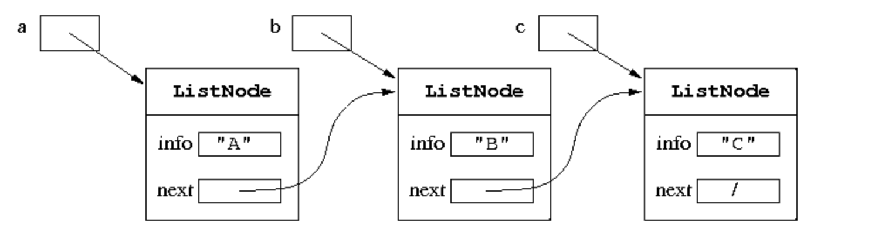
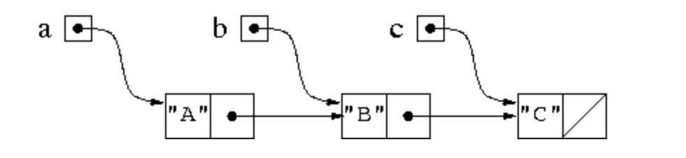
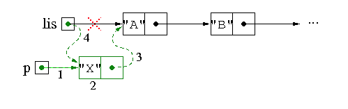
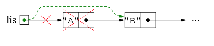
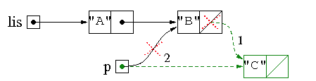
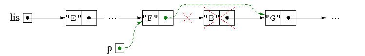
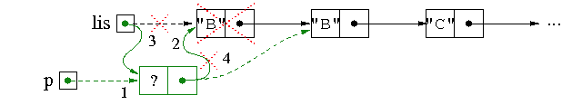

# UNIT 11
## 동적 배열 및 연결리스트

- 배열의 한계


    배열은 변경 불가
    요소의 수와 상관없이 크기에 비례하는 메모리양 차지
    새 값을 삽입하거나 제거할때 비효율


- 동적메모리 관리


    동적메모리란?
    필요할 때마다 메모리 자원을 할당하고 더 이상 필요하지 않을 때마다 해제


- 연결리스트

    
    비어있지 않는 리스트는 첫 번째 노드에 대한 참조로 표시
    빈 목록은 null로 표시


```java
public class ListNode {
  public ElementType info; //노드 안에 있는 값
  public ListNode next;    //다음 노드 주소
}
```





- ArrayList vs LinkdedList 성능 비교


    순차적으로 데이터 추가/삭제         ----->ArrayList가 더 빠름
    중간(비순차적)에 데이터 추가/삭제    ----->LinkedList가 더 빠름
    접근시간(데이터 읽는 시간)         ----->ArrayList가 더 빠름


- 연결된 리스트에 대한 작업

    
    리스트가 비어있는지 확인
    노드를 수정하거나 그 안에 값을 얻기위해 그 노드에 액세스
    목록의 크기를 결정
    특정 요소를 삽입/제거
    리스트를 배열,문자열등으로 변환


- 새 요소를 리스트의 첫 번째 요소로 삽입

1. 새 노드 할당
2. info에 값 할당
3. 새 노드를 원래 리스트와 연결
4. 새로 생성된 노드를 첫 번째 노드로 바꾸기



```java
public static ListNode insertFirst(ListNode lis, String s) {
        ListNode p = new ListNode();     // 1
        p.info = s;                      // 2
        p.next = lis;                    // 3
        lis = p;                         // 4
        return lis;
        }
```

- 리스트의 첫 번째 요소 삭제

1. 리스트가 비어있으면 아무 것도 하지 않는다
2. 그렇지 않으면 첫 번째 요소 다음에 오는 요소부터 시작하여 리스트 반환





```java
public static ListNode deleteFirst(ListNode lis) {
  if (lis != null)
    lis = lis.next;
  return lis;
}
```

- 연결리스트에 있는 노드 액세스 하는 방법

```java
ListNode lis = ...
ListNode p = lis;
while (p != null) {
  process the node referenced by p
  p = p.next;
}
```

- 재귀를 사용해서 리스트 있는 값 모두 출력하기
```java
public static void print(ListNode lis, PrintStream ps) {
  if (lis == null)
    ps.println();                 // base case
  else {
    ps.print(lis.info + " ");     // process the first element
    print(lis.next, ps);          // recursive call
  }
}

```


- 연결리스트 요소 검색
```java
public static boolean search(ListNode lis, String s) {
  while (lis != null) {
    if (lis.info.equals(s)) return true;
    lis = lis.next;
  }
  return false;
}

```


- 리스트 마지막 요소로 새 요소 삽입
```java
  public static ListNode insertLast(ListNode lis, String s) {
        ListNode p = new ListNode();      // note: p.next == null
        p.info = s;

        if (lis == null)
        return p;                       // the list contains only the new node
        else {
        ListNode last = lis;
        while (last.next != null)       // find last element
        last = last.next;
        last.next = p;
        return lis;
        }
        }
```


- 리스트 마지막 요소로 새 요소 삽입 재귀 사용
```java
public static ListNode insertLast(ListNode lis, String s) {
  if (lis == null) {
    ListNode res = new ListNode();    // note: res.next == null
    res.info = s;
    return res;
  } else {
    lis.next = insertLast(lis.next, s);
    return lis;
  }
}
```


- 파일에서 요소를 읽어오는 리스트 생성



```java
public static ListNode read(BufferedReader br) throws IOException {
  // note: the value EOF (^D) in input terminates the insertion
  ListNode lis = new ListNode();    // create generator node
  ListNode p = lis;

  String s = br.readLine();
  while (s != null) {
    p.next = new ListNode();        // note: p.next.next == null
    p = p.next;
    p.info = s;
    s = br.readLine();
  }

  lis = lis.next;                   // delete generator node
  return lis;
}

```


- 리스트에서 첫 번째 요소 항목 삭제
1. 요소를 검색하면서 목록을 스캔
2. 요소가 목록에 나타나지 않으면 아무 작업도 수행x
3. 나타난 경우
    1. 리스트의 첫번째 일때 목록의 두번째 요소에 대한 참조 반환
   2. 리스트의 첫번째도 아니고 마지막도 아닐때 요소가 다음 요소를 가르키도록 삭제할 요소의 앞요소를 업데이트
   3. 리스트의 마지막 일때 이전 요소의 필드를 null로 설정



```java
public static ListNode delete(ListNode lis, String s) {
  ListNode p = new ListNode();    // create the generator node
  p.next = lis;
  lis = p;

  boolean found = false;
  while ((p.next != null) && !found) {
    if (p.next.info.equals(s)) {
      p.next = p.next.next;       // delete the element
      found = true;               // forces exit of the loop
    } else
      p = p.next;
  }

  return lis.next;                // delete generator node
}
```

- 리스트에서 해당 요소 모든 항목 삭제


      목록의 끝에 도달한 경우에만 중지





```java
public static ListNode deleteAll(ListNode lis, String s) {
  ListNode p = new ListNode();    // create the generator node
  p.next = lis;
  lis = p;

  while (p.next != null) {
    if (p.next.info.equals(s))
      p.next = p.next.next;       // delete the element
    else
      p = p.next;
  }

  return lis.next;                // delete generator node
}

```


- 연결리스트에서 요소의 모든 항목 삭제을 재귀를 사용
```java
public static ListNode deleteAll(ListNode lis, String s) {
  if (lis == null)
    return null;
  else if (lis.info.equals(s))
    return deleteAll(lis.next, s);
  else {
    lis.next = deleteAll(lis.next, s);
    return lis;
  }
}

```


